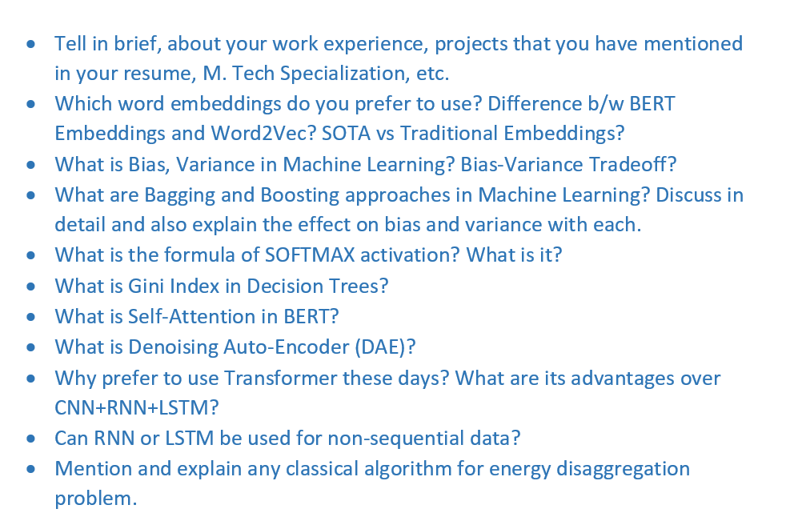
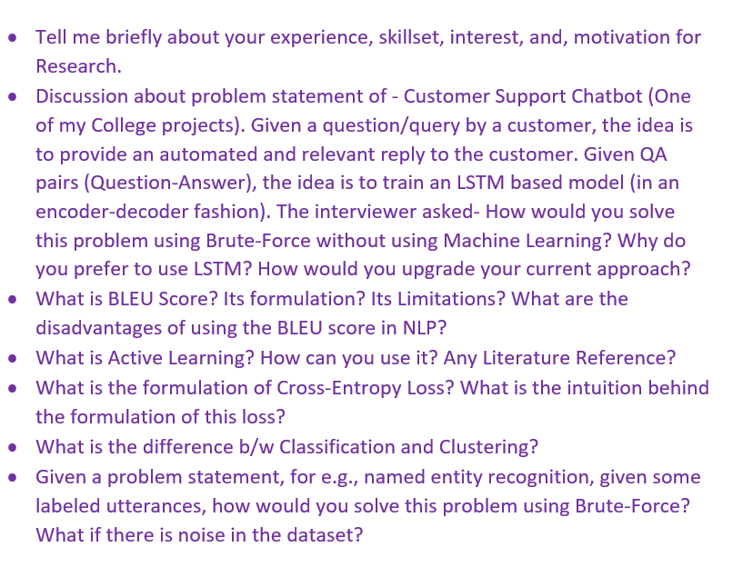
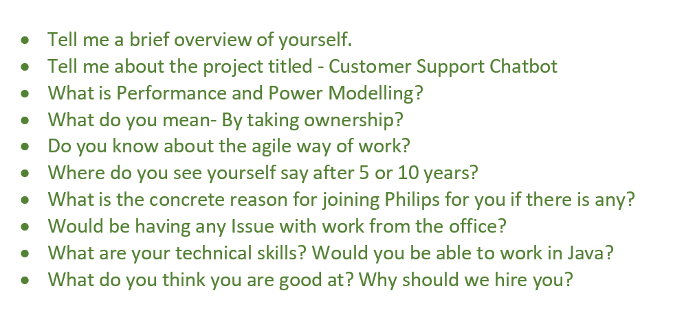

#### Find original post at- 
[Philips Research Interview Experience @Medium](https://medium.com/p/a232ef94ef04)   
[Image Reference](https://www.google.com/url?sa=i&url=http%3A%2F%2Fmanuelbaumann.de%2F&psig=AOvVaw35q_Srqml8AutFy0GotYL4&ust=1649053241769000&source=images&cd=vfe&ved=0CAsQjRxqFwoTCPjLtZig9_YCFQAAAAAdAAAAABAD)

### Followed by Resume Shortlisting, there were 4 rounds of interviews —
#### R1 = Technical, Level = [Easy-Medium]
#### R2 = Technical, Level = [Medium-Hard]
#### R3 = Mix of Technical and Managerial, Level = [Easy-Medium]
#### R4 = HR, Level = [Easy]    

    
### **Resume Shortlisting**  

It was a lateral hiring situation. I already had 1.5 years of experience in Research and Development with a company. I sent my resume to one of our alumni via Alma Connect (almaconnect.com). He forwarded it to Human Resources.
I got a call from HR within three to four weeks for the first round. I made the cut because I did have some publications already prior to RnD Experience. You can see my list of publications on my Google Scholar account — [Google Scholar](https://scholar.google.co.in/citations?hl=en&user=Kc6YNPEAAAAJ).
Furthermore, my skillset matched the expectations of the Research profile. You can view my skillset on my [Website](https://rajat-kumar.netlify.app/).  

### **Round 1: Technical**
  

### **Round 2: Technical**

### **Round 3: Technical + Managerial**

### **Round 4: HR**
The round went for 15–20 minutes. General HR discussion and he told me about the results. Finally, I was selected. After a week or so, I was given the details of my Position, Compensation, and the Location details. I was selected for Research Associate II position in Philips Research, Bangalore.
During the process, I encountered a large number of Philips employees who all gave very positive feedback about their employers. I am friends with three people who work at Philips. At the end of the day, it was a great experience for me.