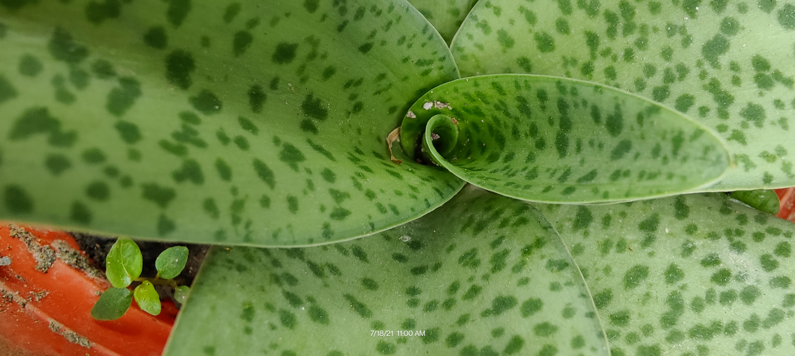

---

# Summary for listings and search engines
    
# Link this post with a project
projects: []

# Show this page in the Featured widget?
featured: true

# Featured image
# Place an image named `featured.jpg/png` in this page's folder and customize its options here.
image:
  focal_point: ""
  placement: 2
  preview_only: false

# Date published
date: "2019-12-06T00:00:00Z"

# Date updated
lastmod: "2019-12-06T00:00:00Z"

tags:
- Nature
categories:
- Gallery

---

    

        <h1><i class="fa fa-camera-retro" aria-hidden="true"></i> प्रकृति: (prakṛtiḥ)</h1>
        
A bunch of beautiful images that I did take....

    

    

        

            

                
            

        

        

            

                
            

        

    

        

            
        

    

    

            

                
            

        

        

            

                
            

        

    

        

            
        

    

        

            

                
            

        

    

        

            
        

    

    

        

            
        

    

    

        

            
        

    

    

        

            
        

    

    

</body>
</html>
