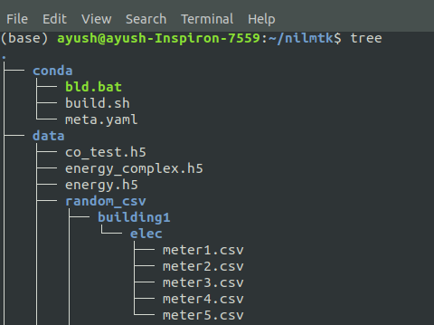
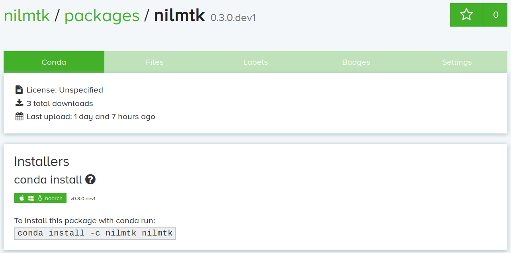

Find original post at- 
[https://sustainability-lab.github.io/2019/05/19/creating-conda-installer.html](https://sustainability-lab.github.io/2019/05/19/creating-conda-installer.html)

* Given the recurring installation issues of the package (especially on Windows), an important step forward towards the future releases of the package was to have a conda or pip installation of the package available to ease accessibility of the library. This would help focus the attention of the community to more of the core issues.

We were new to building packages for distribution, so we started by understanding the build process for python packages. The main NILMTK package had another dependency that was NILM specific, called the **nilm_metadata**. **NILMTK** was based on noarch architecture and so was platform independent, whereas **nilm_metadata** was platform dependent. So our aim was to build two python packages, with **nilm_metadata** being a dependency of **NILMTK**, so that ultimately the user only had to install NILMTK. This would reduce the current multiple step process of cloning the git repository of both the packages and installing them manually to a simple *conda install* command.   

Some past efforts to get a stable conda build helped us get a head start towards creating a build that works on all platforms. Building a conda package requires installing conda build and creating a conda build recipe. You then use the conda-build command to build the conda package from the conda recipe.

1. Installing *conda-build*  

    `conda install conda-build`

2. Creating a conda-recipe for your package  
    A conda recipe consists of two parts - a *meta.yaml* file that contains the metadata such as package name, package version, host requirements, etc to assist the build. It is a convention to create a *recipe* or *conda.recipe* directory inside your main package to store the recipe files. 

    

    We already had a skeleton recipe available, but is easy to obtain one using:
    * Existing recipes  
         [https://github.com/AnacondaRecipes](https://github.com/AnacondaRecipes)  
         [https://github.com/conda-forge](https://github.com/conda-forge)
   
    * Skeletons from other repositories (PyPI, CRAN, CPAN, RPM)
            `conda skeleton pypi <package name on pypi>`  
            or  
            `conda skeleton cran <name of pkg on cran>`  

    * When all else fails, write a recipe
         Only required section:  
            ```
            package:     
              name: abc     
              version: 1.2.3    
             ```
3. Listing the package dependencies  
       The requirements section of the *meta.yaml* is where you list out all your dependencies.

    * Build requirements  
        Tools to build packages with; things that don’t directly go into headers or linking  
        Compilers  
        autotools, pkg-config, m4, cmake  
        archive tools  

    * Host requirements  
        External dependencies for the package that needs to be present at build time  
        Headers, libraries, python/R/perl  
        Python deps used in setup.py  
        Not available at runtime, unless also specified in run section  

    * Run requirements  
        Things that need to be present when the package is installed on the end-user system  
        Runtime libraries  
        Python dependencies at runtime  
        Not available at build time unless also specified in build/host section  

    > Note: Make sure you have listed out the correct version of your dependencies as future releases of those packages may cause incompatibility issues. 
4. Creating the build files for the package  
    The files required for building are the *build.sh* (Unix) or *bld.bat* (Windows) which consists of the actual commands to be executed during the building process.

    > Note: Filenames are of paramount importance here.  
    
    All we need to do is execute the setup.py file. The commands are slightly different depending on the version. Our files contained:
    * build.sh  
        `$PYTHON setup.py install --single-version-externally-managed --record=record.txt`
    * bld.bat  
        `"%PYTHON%" setup.py install --single-version-externally-managed --record=record.txt
        if errorlevel 1 exit 1`  
5. Building the package
    Change your directory to location of your recipes and run  
    `conda build .`  
    A successful build will give you the path to your newly built package and the command to upload it to anaconda-cloud.  
    `anaconda upload <path of the tar.z2 file>`  
    Login to your anaconda-cloud account or signup to create your own channel, and enter your login credentials during the upload prompt.  

You can now checkout your anaconda-cloud page for your package. This here is the new NILMTK page.
 

We also learned the process to upload the package on **PyPI**, which was much simpler. The following documentation was very helpful in gaining insight into the *pip* packaging process:  
[Packaging Python Projects](https://packaging.python.org/tutorials/packaging-projects/ "Packaging Python Projects")  

We also came across a method that allows for creating a *conda* installer of any package from an existing *pip* installer of the same package. So if you have an existing *pip* installer for your package, you can use a simple shell script that creates the skeleton recipes for your python version from the *pip* installer of the package, converts the package for other platforms and uploads it to *anaconda cloud*. Checkout the following blog for learning more about this process.  
[Build a conda package from an existing PyPI package](https://medium.com/@giswqs/building-a-conda-package-and-uploading-it-to-anaconda-cloud-6a3abd1c5c52 "Build a conda package from an existing PyPI package")

**References**  

[Conda Packages](https://python-packaging-tutorial.readthedocs.io/en/latest/conda.html "Conda Packages")

**Developing Article**