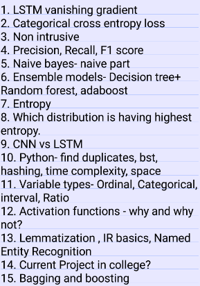

#### Find original post at- [TCS Research Interview Experience @Medium](https://rajat-tech-002.medium.com/tcs-innovation-labs-interview-experience-29381bbc999b)

# Rounds of Interviews = 3
### **Round 1: Resume Shortlisting**  
It is based on experience in ML/NLP Based projects. I have published 2 papers. One in ACM and the other one in IEEE. Also, I have worked on some good projects in my second semester. So I got easily shortlisted. (8 were shortlisted from my college)

### **Round 2: Technical Interview (Telephonic)** 

>**Panel**: My panel had 2 interviewers. As told by our HR, interviews are conducted by highly experienced people. The interview was conducted in TCS campus only.  

A. In the beginning, they nicely introduced themselves and asked the same from me.  
B. After I gave a brief introduction to them, they started asking me questions about the projects that I have mentioned in my resume.  
C. The questions were related to technical depth, knowledge and basic concepts.

The following questions were asked:

D. Most of the questions judged the clarity and depth of basic ML concepts that were used in the projects.  
E. Linear Algebra, Optimization Techniques, Statistics are the building base for Machine Learning / Data Science / Deep Learning techniques.  
F. After that, I was also asked many questions about the project and research paper that I did in IIT Gandhinagar.  
### **Round 3: Human Resource (HR)** 
It also went very well. I was asked about the previous interview experience and what I think about my performance. Moreover, some questions related to skills and co-curricular activities were also there. It took 10 minutes' time and HR was happy with the answers.  

**Overall Experience:**  
It was a very good experience. My interview went for around 90–100 minutes. The interviewers were very calm and gave time to solve or think about the solution of each question they asked. My interview went well as I was able to give most 
answers (Around 70–80%). I had brushed up my concepts thoroughly before the interview which helped me a lot.  

**Results :**  

5 out of 8 made it to TCS Innovation Labs and I was one of them.

**Suggestions :**  
A. One should know all the technical depth and details of the project that he/she has done.  
B. The reasoning and analysis of each project you do is important in research. A thorough literature survey and understanding of the problem statement well is the first step.  
C. Statistics and Probability theory is the backbone of ML/AI. So one should know basic concepts and intuition in these.
D. Motivation for research is most important.  

**Some Important Links/Notes:**

> -Maths behind SVM (Support Vector Machine): https://github.com/rajatgupta1234/ML_Projects/blob/master/SVM_Maths.pdf

> -RNN (Recurrent Neural Network), LSTM (Long Short Term Memory) Maths and implementation on Automatic Speech Recognition: https://github.com/rajatgupta1234/ML_Projects/blob/master/ASR_RNN_LSTM_MATHS.pdf  

> -3blue1brown Youtube Course on Linear Algebra: Essence and Visualization of vectors in the real world — https://www.youtube.com/watch?v=kjBOesZCoqc&list=PL0-GT3co4r2y2YErbmuJw2L5tW4Ew2O5B  

> -Mel Frequency Cepstral Coefficients (MFCC) and PCA maths: https://github.com/rajatgupta1234/ML_Projects/blob/master/MFCC_PCA.pdf  

> -Personal notes on Linear Algebra, College Projects, Principal Component Analysis/SVD, Loss Functions, Eigen Vectors, Transformations, GAN, and Autoencoders. https://github.com/rajatgupta1234/ML_Projects/blob/master/Interview_Prep_ML_Notes.pdf  

**Publications**
1. Towards reproducible state-of-the-art energy disaggregation. In Proceedings of the 6th ACM International Conference on Systems for Energy-Efficient Buildings, Cities, and Transportation (BuildSys ’19). ACM, New York, NY, USA, 193–202.
Link: https://dl.acm.org/doi/abs/10.1145/3360322.3360844
2. “Image-based Indian monument recognition using convoluted neural networks” 2017 International Conference on Big Data, IoT and Data Science (BID), Pune
Link: https://ieeexplore.ieee.org/abstract/document/8336587/
3. Evaluating Machine Learning Models for Disparate Computer Systems Performance Prediction, 2020 IEEE International Conference on Electronics, Computing and Communication Technologies (CONECCT)
Link: https://ieeexplore.ieee.org/abstract/document/9198512